# weatherny 🌦️📈
weatherny : Weather Data # BigQuery # Correlation 

## Objective
- To carry out interactive queries on the BigQuery console.
- Combine & run analytics on multiple datasets.
- Use CORR function to determine positive, negative, or no correlation between datasets.

## NYC Weather Data in BigQuery

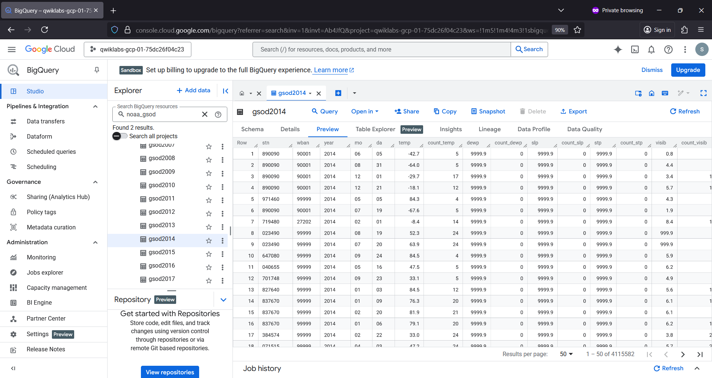

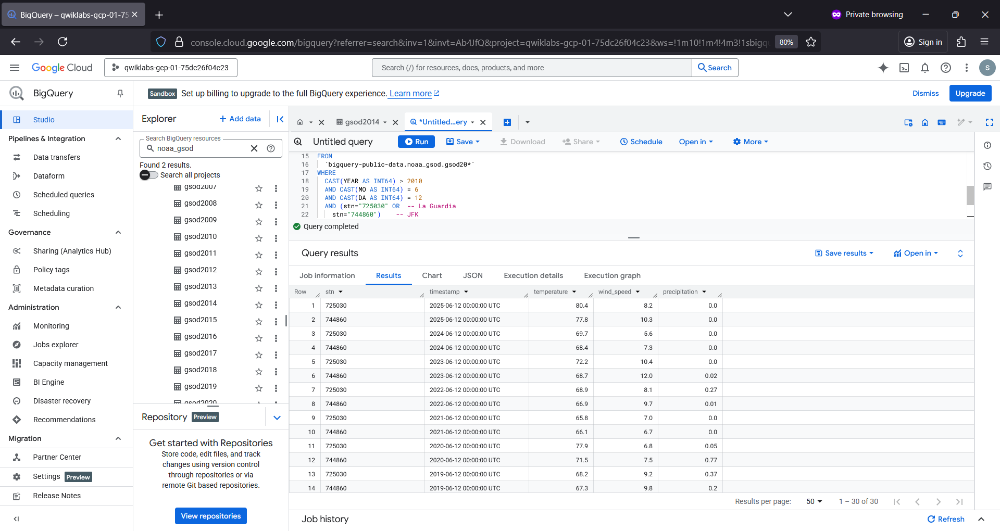

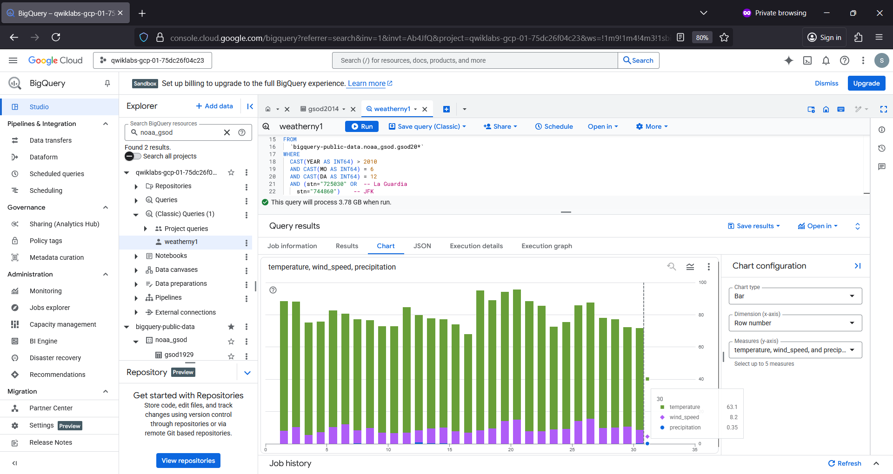

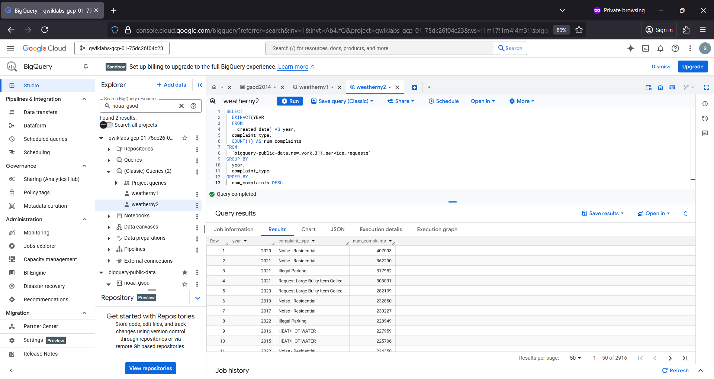

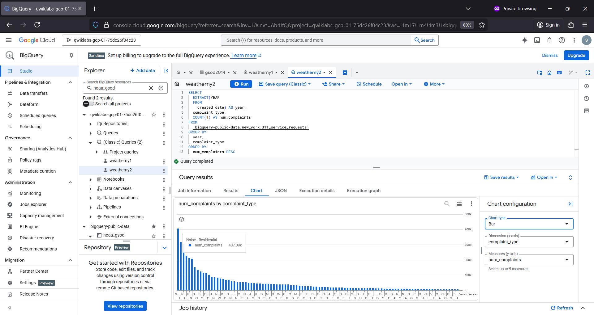

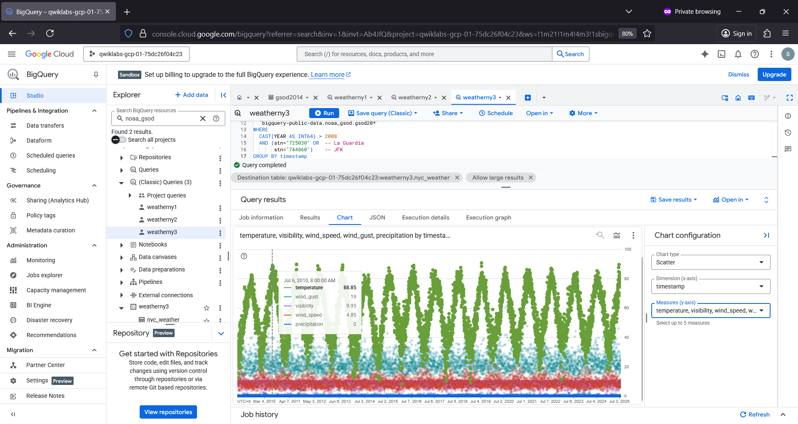

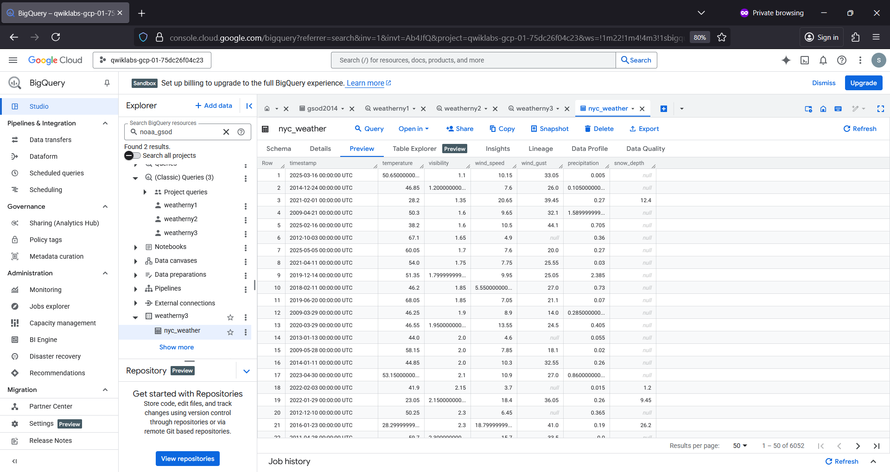

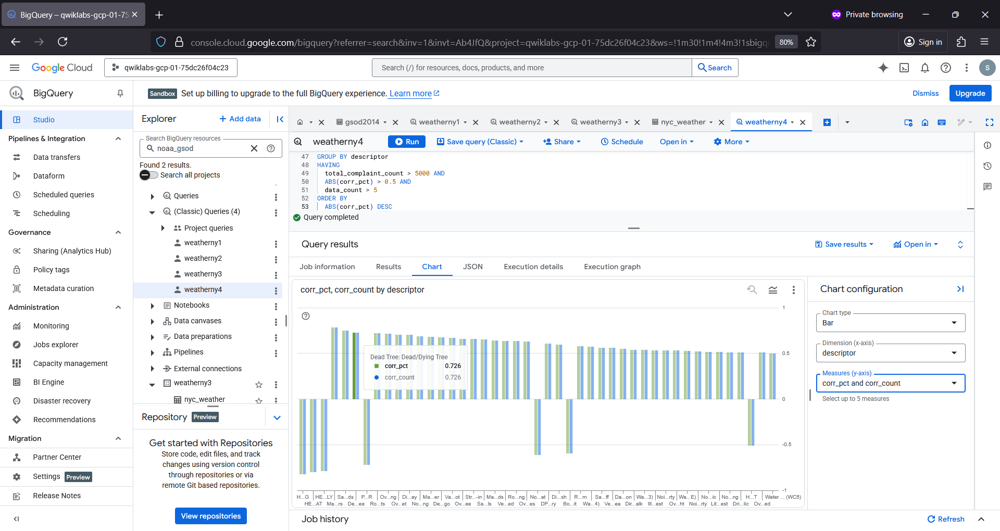

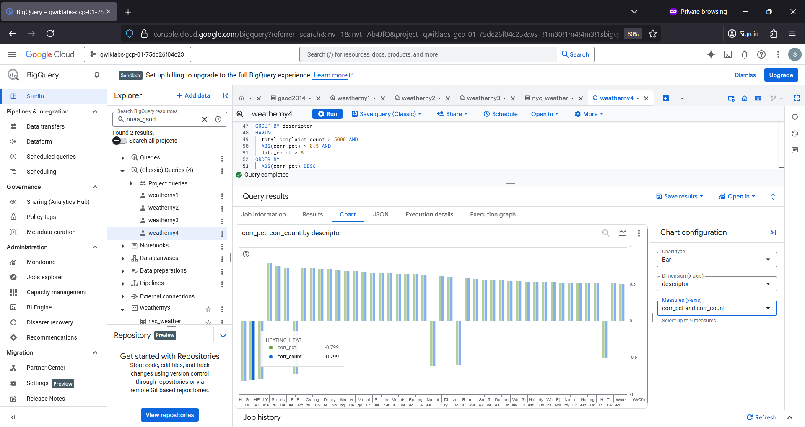

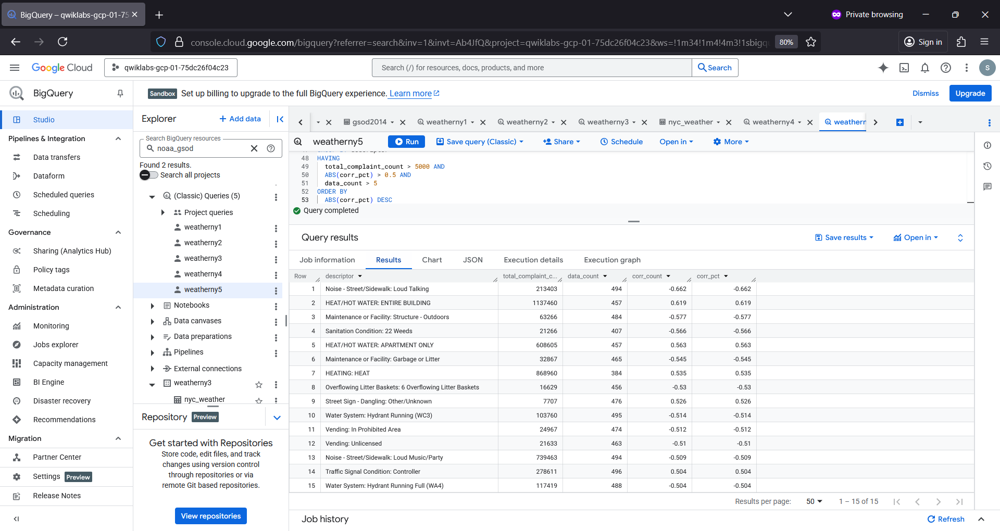

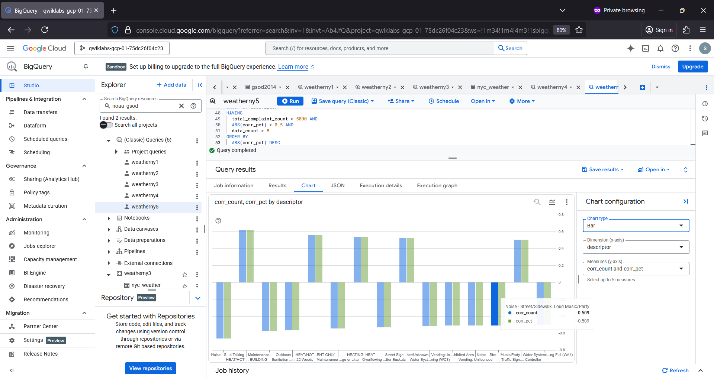

